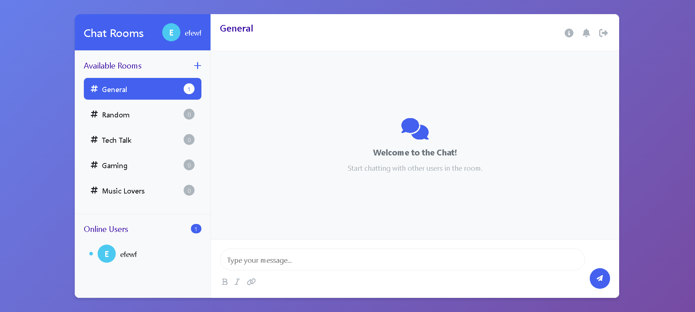
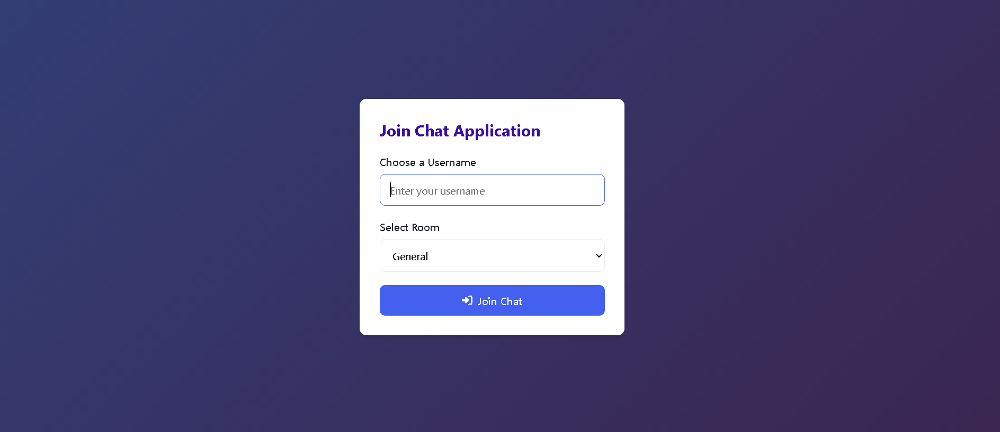
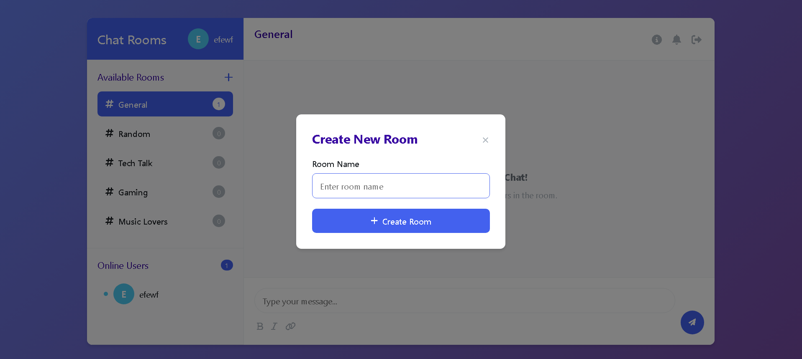

Real-Time Chat Application 💬
A full-stack real-time chat application built with Node.js, Express, Socket.io, and vanilla JavaScript.

### 🛍️ User Interface

🚀 Features
✅ Real-time messaging with WebSockets
✅ Multiple chat rooms with room creation
✅ User authentication with unique usernames
✅ Online users list
✅ Typing indicators
✅ Message formatting (bold, italics, links)
✅ Responsive design for mobile and desktop

🛠️ Technology Stack
Backend: Node.js, Express, Socket.io
Frontend: HTML5, CSS3, Vanilla JavaScript
Real-time: WebSockets
Icons: Font Awesome

📦 Installation & Setup
Prerequisites
Node.js (v14 or higher)

npm (comes with Node.js)

Step 1: Clone or Download

# If using git
git clone <repository-url>
cd chat-application

# Or download and extract the project files
Step 2: Install Dependencies

cd backend
npm install

Step 3: Start the Application

npm start

--Open your's browser automatically 

🎯 Usage
1. Start the server with npm start in the backend directory
2. Open browser to http://localhost:3000
3. Enter a username and select a chat room
4. Start chatting in real-time!
https://screenshots/login.png
Login interface

https://screenshots/chat-interface.png
Main chat interface with online users

### 🧩 log page

### 🛍️ User Interface

### 🛍️ rooms
